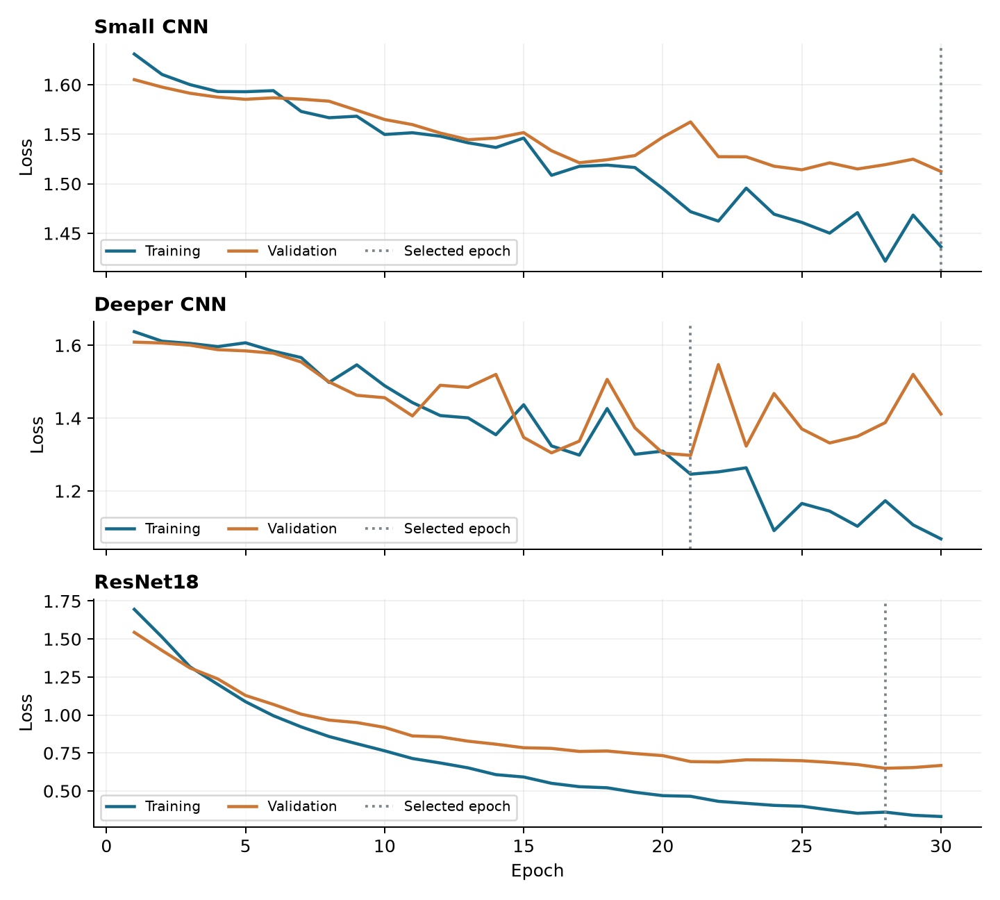
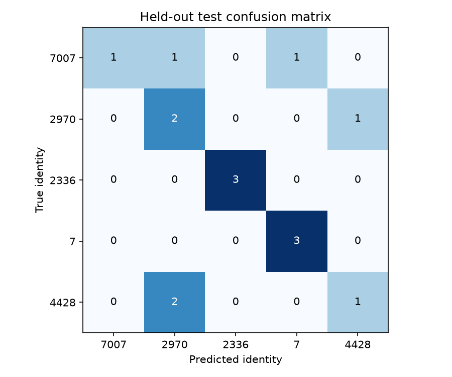

# Milestone 1: classification results

Team: Yosephine Tong, Dario Garza and Aditi.

We compared three image-recognition models. ResNet18 identified the correct person in 10 of 15 test photos (66.7%). The deeper CNN got 6 correct (40.0%), and the small CNN got 5 correct (33.3%).

## Photos and preparation

We use CelebA identity IDs 7007, 2970, 2336, 7 and 4428. Each folder has enough photos to use 23 per person: 17 for learning, 3 for choosing the best model, and 3 for the final test. Using the same number of photos per person keeps the comparison balanced.

In total, we use 85 training, 15 validation and 15 test photos. Six of the 121 available photos are unused. The [saved file list](../configs/splits/group1_repro_v1_seed47.csv) identifies each photo and its group.

We convert photos to color (RGB) and crop them to 224 x 224 pixels. During training, random crops and horizontal flips add variety. For validation and testing, we resize the shorter edge to 256 pixels and take a fixed center crop. Pixel values are adjusted using ImageNet's mean and standard deviation.

## Models and training

The small and deeper CNNs learn from our photos from the start. ResNet18 already learned useful image features from ImageNet, a large image dataset. We keep that part unchanged and train only its final layer to choose among our five identities.

Each model makes 30 passes through the training photos, called epochs. After each pass, we check it on the validation photos, which are used to choose the model. For each model, we save the version with the lowest validation loss (a measure of prediction error). We then choose the model with the most correct validation predictions and evaluate it on the separate test photos.

All models use Adam, learning rate 0.001 and batches of 16. The small CNN has channels 32/64 and dropout 0.25; the deeper CNN has channels 32/64/128/256 and dropout 0.35. The file shuffle uses seed 47 plus the identity number.

## Comparison

| Model | Saved training pass | Validation | Test | Parameters: total / trained | Training (s) | Prediction (ms/photo) |
| --- | --- | --- | --- | --- | --- | --- |
| Small CNN | 30 | 26.7% | 33.3% (5/15) | 19,717 / 19,717 | 92.0 | 11.5 |
| Deeper CNN | 21 | 26.7% | 40.0% (6/15) | 389,701 / 389,701 | 146.0 | 18.1 |
| ResNet18 | 28 | 80.0% | 66.7% (10/15) | 11,179,077 / 2,565 | 115.8 | 35.3 |

Parameters are numbers stored inside a model. Times use an Intel Core i7-7700K CPU with two threads. Training includes validation and saving. Prediction time is the median for one photo at a time over five test passes after warm-up; it excludes image loading and preparation.

## Training progress

Loss measures prediction error; lower is better. Blue shows training photos, orange shows validation photos, and the dotted line marks the saved version.

The custom CNNs improve on training photos, but their validation results are weaker. ResNet18 has the lowest validation error.

## Why we chose ResNet18

We chose ResNet18 because it correctly identified 12 of 15 validation photos (80.0%); each custom CNN identified 4 (26.7%). We made this choice before checking the test results. ResNet18's earlier training on ImageNet gives it useful image features when our own training set is small.

ResNet18 is larger and slower than the two custom CNNs. It contains about 11.18 million model values, called parameters, but we train only 2,565 in its final layer. It takes about 35.3 milliseconds to make a prediction on our CPU, excluding image preparation. We will use it as our starting model for later milestones because it performed best in this comparison.

Rows show the actual person; columns show the prediction. Correct counts for IDs 7007, 2970, 2336, 7 and 4428 are 1, 2, 3, 3 and 1 out of three photos each. Identity 4428 is mistaken for 2970 twice.

The test set is small: just three photos per person. One correct or incorrect prediction changes the overall score by 6.7 percentage points. We need more varied photos to judge how well the model handles different lighting, poses and backgrounds.

## Checking the results

The repository includes the photos, the list showing how they were divided, all three trained models, training logs and test predictions.

See the [README](../README.md) for commands and the [verification record](../results/group1_repro_v1/reproducibility_check.json) for the repeat check. These results are saved as `group1_repro_v1`; Aditi's earlier results remain separate.
